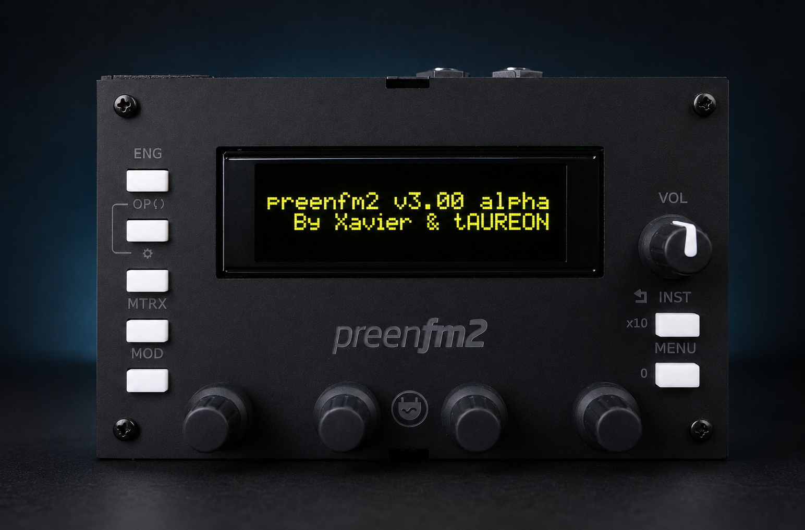
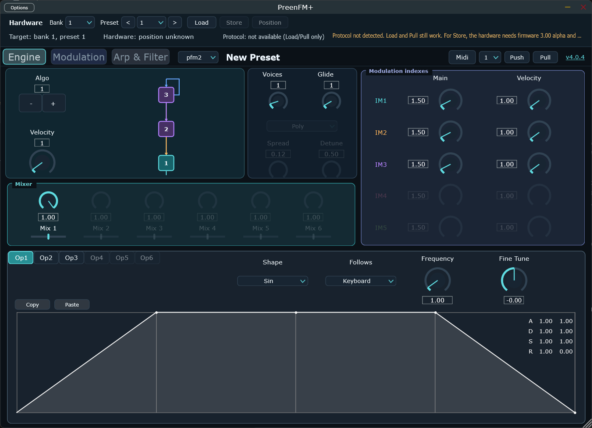
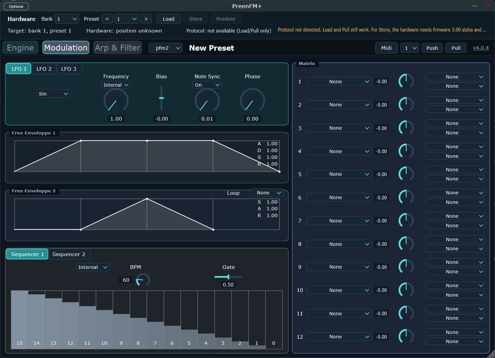
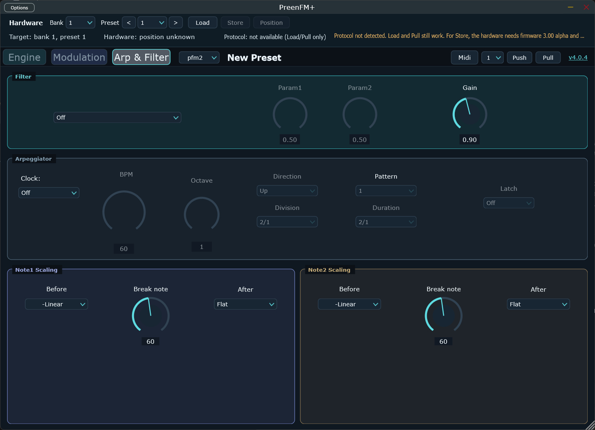

# PreenFM+

PreenFM+ 4.x is a modernized Windows x64 VST3 and standalone editor for the
PreenFM2 and PreenFM3 hardware synthesizers. It combines the complete sound
editing surface of Xavier Hosxe's original controller with a scalable JUCE 9
interface, live bidirectional MIDI editing and direct hardware-preset workflow.

<p align="center">
  
</p>

The PreenFM2 test unit running the hardware-tested 3.00-alpha developer firmware.

## Current features

**Latest pre-release: [4.0.6 Beta 1](https://github.com/sscheidl/preenfm2-Editor/releases/tag/v4.0.6-beta.1).**
Adds opt-in MPE performance-channel routing and fixes from the independent 4.0.5
prototype review. The new binaries are locally tested, but their hardware and
Studio One validation is still pending. The older 4.0.4 beta's successful tests
do not constitute validation of this MPE extension.

For PreenFM2, raw host RPN/NRPN configuration is blocked for safety. Set the MPE
zone and bend range on the hardware/controller; editor channel, MPE manager and
the configured channel of the MPE timbre must match. Native VST3 Note Expression
and CVIN firmware matrix layouts are not supported. See the
[MPE setup, safeguards and hardware test checklist](docs/MPE_EDITOR_IMPLEMENTATION.md).

- complete Engine, Modulation, Arpeggiator, Filter and Note Scaling editing;
- modern scalable vector interface with a permanent hardware-preset header;
- live parameter updates from editor to hardware and from hardware to editor;
- host automation through VST3, tested in Studio One on Windows x64;
- Push and Pull of the complete edit buffer;
- hardware bank/preset selection, previous/next audition, position query and
  direct Store with explicit overwrite confirmation and firmware status;
- VOSIM algorithms 29-32 and LFO shapes 6-8;
- guarded multi-instance MIDI transactions and deterministic protocol tests.

PreenFM+ 4.x requires matching VOSIM firmware. The full Load, Position and Store
workflow requires the experimental PreenFM2 `3.00 alpha` firmware and a
dedicated timbre MIDI channel. Users of older firmware should remain on the
original 3.x editor.

> [!IMPORTANT]
> **Experimental AI-assisted development.** PreenFM+ 4.x is a tAUREON
> research project exploring the practical benefits and limits of AI-assisted
> coding for audio applications and synthesizer software. Substantial parts of
> the 4.x modernization were developed through human-directed collaboration
> with [OpenAI Codex](https://openai.com/codex/) and
> [Anthropic Claude Code](https://www.anthropic.com/claude-code). Treat 4.x
> builds as experimental software and verify important behaviour with your own
> host, MIDI setup and hardware. See the
> [tAUREON AI development notice](docs/AI_DEVELOPMENT_NOTICE.md) for details.

## Credits and project lineage

PreenFM+ stands on work generously made available by other developers:

- **[Xavier Hosxe (`Ixox`)](https://github.com/Ixox)** created the original
  [preenfm2Controller](https://github.com/Ixox/preenfm2Controller) editor and
  the PreenFM synthesizer ecosystem on which this fork is based.
- **[Patrice Vigouroux (`pvig`)](https://github.com/pvig)** developed the 2024
  [PreenFM2 VOSIM firmware extension](https://github.com/pvig/preenfm2/commit/9da152d14fe1946b9926645d1179404facab8eb6),
  which provides the algorithms and firmware behaviour targeted by PreenFM+
  4.x.
- The editor uses the [JUCE](https://juce.com/) application and plug-in
  framework.

Many thanks to Xavier and Patrice for their original work and for publishing
it for the community. The 4.x modernization, integration, testing and project
direction are maintained as a tAUREON experimental project with assistance
from Codex and Claude Code. The AI services are development tools and are not
the upstream authors or maintainers of PreenFM.

## License

PreenFM+ is free software, licensed under the **GNU General Public License
v3.0 or later** (GPLv3+). The original editor's source files carry Xavier
Hosxe's GPLv3+ copyright and license header; that license applies to the
project as a whole, and the full text is in [LICENSE](LICENSE).

This build also links [JUCE](https://juce.com/) 9, which is dual-licensed
under AGPLv3 or a commercial JUCE licence. Distributing this open build must
therefore comply with the AGPLv3 requirements (in particular, making the
complete corresponding source available); a closed-source build would need a
commercial JUCE licence instead. The bundled Exo font keeps its own
[SIL Open Font License](<Plugin/Source/UI/OTF/SIL Open Font License.txt>). See
[docs/MODERNIZATION.md](docs/MODERNIZATION.md#licensing-note) for more detail.

## Modern CMake build

PreenFM+ 4.0.6 targets JUCE 9.0.0, C++17, VST3 and a standalone plugin host.
JUCE is fetched automatically and pinned to a release tag, so no sibling `JUCE_6.0`
directory or generated Projucer project is required.

Requirements on Windows:

- CMake 4.4 or newer
- Visual Studio 2026 Build Tools with the C++ workload
- Windows 10/11 SDK

```powershell
cmake --preset windows-vs2026-x64
cmake --build --preset windows-vs2026-x64-release
```

The release artefacts are written below
`build/windows-vs2026-x64/PreenfmEditor_artefacts/Release`.

The `windows-vs2022-x64` presets remain available as a fallback.

Only the CMake-based Windows x64 build is maintained and locally tested for 4.0.6. The
checked-in Projucer, Visual Studio 2019, Linux and macOS projects are legacy
references and are not release build paths.

### Hardware validation status

As of August 2026, the matching PreenFM2 `3.00 alpha` VOSIM firmware is running
on physical hardware without observed anomalies. PreenFM+ 4.0.4 has remained
stable during Studio One use, and most editor-to-hardware workflows have been
tested manually on the real instrument, including bidirectional parameter
editing and the hardware-preset workflow. This is substantial practical
validation, but not exhaustive coverage of every parameter mapping, host or
rare timeout/error path.

See [docs/MODERNIZATION.md](docs/MODERNIZATION.md) for migration details,
validation status, corrected legacy bugs and remaining technical debt. Version
4.x includes substantial correctness work inherited from the original editor in
addition to its new firmware and GUI support.

## PreenFM+ 4.x interface

### Engine and operators



### Modulation and step sequencers



### Filter, arpeggiator and note scaling



For questions about the original PreenFM ecosystem, see the
[PreenFM forum](https://ixox.fr/forum/index.php?topic=69349.0) and the
[upstream editor repository](https://github.com/Ixox/preenfm2Controller).
