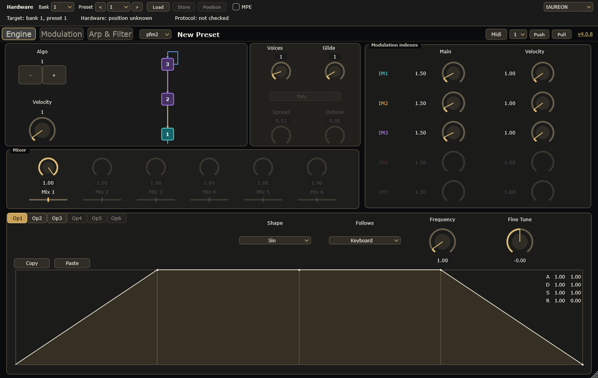
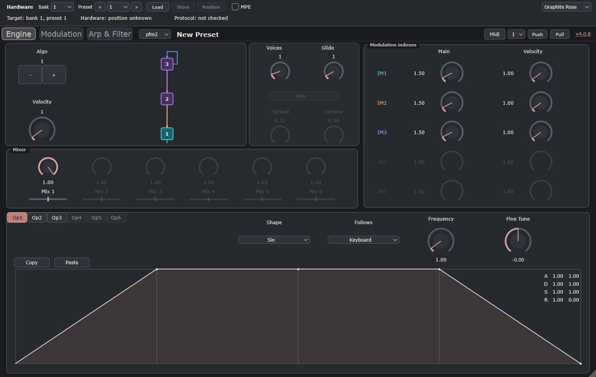
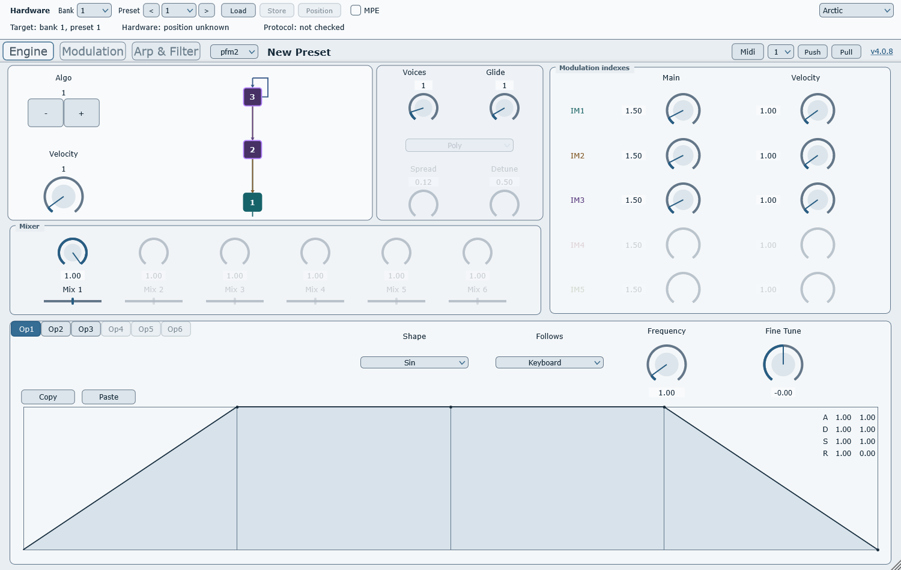
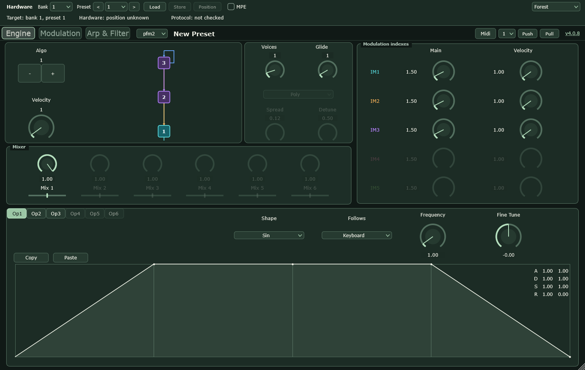
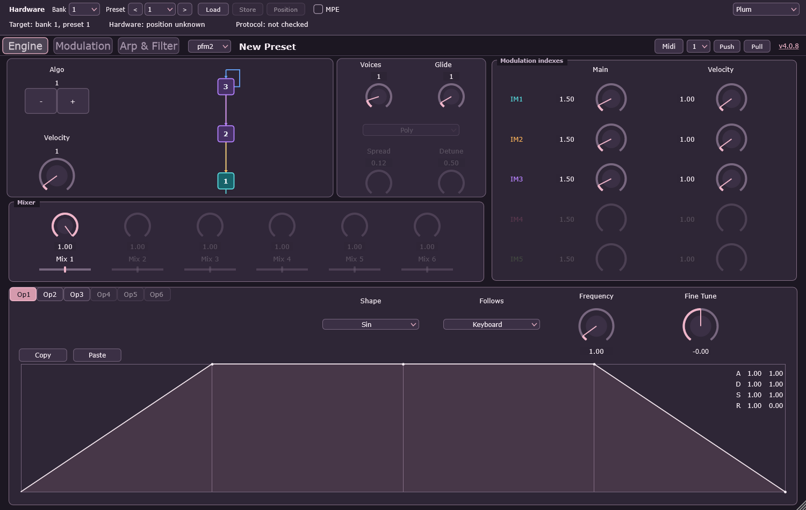

# PreenFM+ 4.0.8 colour themes

Five new palettes supplement Classic. Choose them in the top hardware header;
changes are immediate across Engine, Modulation and Arp & Filter.

| Theme | Background | Surface | Raised surface | Accent |
| --- | --- | --- | --- | --- |
| Classic | `#0B1117` | `#111A24` | `#182532` | `#35C2C8` |
| tAUREON | `#090B0D` | `#191A19` | `#302D27` | `#C8A15A` |
| Graphite Rose | `#181A1D` | `#25282D` | `#30343A` | `#BD7E7C` |
| Arctic | `#E9EEF2` | `#F8FAFC` | `#DCE5EB` | `#356D94` |
| Forest | `#101916` | `#1B2B24` | `#263A30` | `#9BC6A5` |
| Plum | `#1C1722` | `#2D2535` | `#3B3045` | `#D59AAD` |

The tAUREON palette uses the supplied brand concept: near-black,
warm charcoal/bronze surfaces, ivory text and gold highlights. It is intentionally
less blue than Classic. Graphite Rose replaces Graphite Amber with a restrained,
desaturated red accent; the saved theme index remains unchanged. No decorative
photographs or star fields are used inside the working interface.

## Actual editor renders

These images come from the offline GUI test using the real JUCE components.
They are not AI mockups and do not imply a live hardware connection.

### tAUREON

### Graphite Rose

### Arctic

### Forest

### Plum

## Behaviour and scope

- The choice is a local appearance preference shared by VST3 and standalone
  for new instances. It is not a synth parameter or part of a patch/DAW state.
- Each processor has its own LookAndFeel. Switching one existing instance does
  not recolour another; the last saved choice is used for new instances.
- Classic remains the initial default when no preference exists.
- Carrier/modulator identity colours remain stable; light-mode IM connections
  use darker shades for legibility. All diagrams remain vector graphics.
- No MIDI routing, NRPN/Store protocol or firmware code was changed.
- Automated checks do not replace testing in a host, visual inspection on
  different displays, or the requested independent review.
